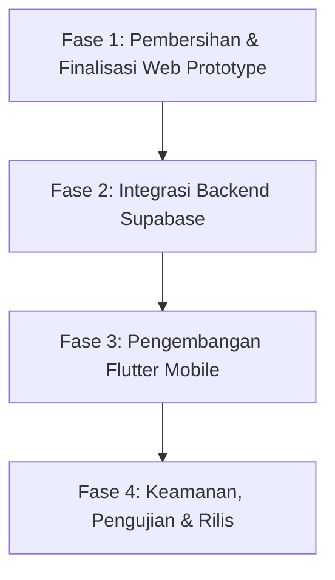

# Rencana Fase Perbaikan & Pengembangan Lanjutan - SAIS

Dokumen ini merinci langkah-langkah sistematis (fase) untuk meningkatkan prototipe aplikasi **Sistem Informasi Sekolah (SAIS)** saat ini menjadi sistem produksi full-stack yang fungsional menggunakan **Web Admin**, **Flutter Mobile**, dan **Supabase**.

---

## 🛠️ Fase 1: Pembersihan & Konsolidasi Prototype Web
Fokus pada merapikan aset kode web yang ada di folder `scratch/SAIS` dan menyelesaikannya sebagai frontend mock yang 100% siap diintegrasikan.

- [ ] **Merapikan Struktur Proyek:** Memindahkan file web dari folder `scratch/` ke folder root produksi yang bersih.
- [ ] **Sinkronisasi Navigasi:** Memastikan tidak ada *broken link* antar halaman dashboard (Admin, Guru, Siswa).
- [ ] **Penyelesaian Detail UI Halaman Mock:**
  - Melengkapi form manajemen kelas, pelajaran, dan jadwal agar interaksinya se-responsif halaman `siswa.html`.
  - Mengimplementasikan visualisasi/diagram sederhana pada dashboard menggunakan library CSS/JS ringan (seperti Chart.js).

---

## 💾 Fase 2: Integrasi Backend & Database (Supabase) ✅ DALAM PROGRESS

📄 **Dokumentasi Lengkap:** `FASE2_Integrasi_Supabase.md`
📄 **SQL Schema:** `FASE2_Seed_Data_SQL.sql`

Menghubungkan aplikasi web dengan database nyata di Supabase untuk menggantikan penyimpanan sementara (`localStorage`) dan simulasi waktu tunggu.

- [ ] **Inisialisasi Proyek Supabase:** Membuat project baru di dashboard Supabase.
- [ ] **Perancangan Skema Database:**
  - Membuat tabel `profil` (untuk data umum pengguna dengan role: `admin`, `guru`, `siswa`).
  - Membuat tabel `siswa` (terhubung ke profil, menyimpan NISN, kelas, dll.).
  - Membuat tabel `guru` (terhubung ke profil, menyimpan NIP, mata pelajaran yang diajar, dll.).
  - Membuat tabel `kelas`, `mata_pelajaran`, `jadwal_pelajaran`, `nilai`, dan `presensi`.
- [ ] **Integrasi Supabase JS Client:**
  - Memasang Supabase CDN/SDK pada file HTML.
  - Mengubah fungsi login di `index.html` menggunakan `supabase.auth.signInWithPassword()`.
  - Mengubah operasi CRUD di `siswa.html`, `guru.html`, dll., dari `localStorage` menjadi query langsung ke tabel Supabase.

### ✅ Checklist Fase 2

| No | Task | File | Status |
|----|------|------|--------|
| 1 | Buat project Supabase | - | ☐ |
| 2 | Jalankan SQL Schema | `FASE2_Seed_Data_SQL.sql` | ☐ |
| 3 | Update supabase-config.js | `src/supabase-config.js` | ☐ |
| 4 | Enable RLS di semua tabel | SQL Editor | ☐ |
| 5 | Test login dengan Supabase Auth | `src/index.html` | ☐ |
| 6 | Test CRUD dengan Supabase | `src/siswa.html`, dll. | ☐ |

---

## 📱 Fase 3: Pengembangan Aplikasi Mobile (Flutter)
Mulai membangun aplikasi mobile sesuai dokumen desain yang direncanakan sebelumnya, ditargetkan untuk peran **Siswa/Orang Tua** dan **Guru**.

- [ ] **Setup Project Flutter:** Menginisialisasi project Flutter baru dengan konfigurasi `supabase_flutter`.
- [ ] **Pembuatan Halaman Login Mobile:**
  - Membuat UI form login yang elegan sesuai mockup visual.
  - Implementasi *secure storage* untuk menjaga sesi login tetap aktif (*keep logged in*).
- [ ] **Pengembangan Dashboard Siswa (Mobile):**
  - Menampilkan jadwal pelajaran hari ini secara dinamis dari database.
  - Menampilkan riwayat nilai akademik dan kehadiran.
- [ ] **Pengembangan Dashboard Guru (Mobile):**
  - Fitur presensi siswa harian berbasis mobile (checklist kehadiran).
  - Fitur input nilai tugas secara cepat melalui aplikasi handphone.

---

## 🔒 Fase 4: Keamanan, Pengujian, & Deployment
Memastikan aplikasi aman dari akses yang tidak sah, menguji alur kerja secara menyeluruh, dan meluncurkannya untuk digunakan oleh sekolah.

- [ ] **Row Level Security (RLS) di Supabase:**
  - Membuat aturan (*policies*) keamanan agar Siswa hanya bisa membaca data miliknya sendiri.
  - Membuat aturan agar Guru hanya bisa mengedit nilai di kelas yang mereka ajar.
  - Memberikan hak akses penuh (baca/tulis) hanya untuk Admin.
- [ ] **Pengujian Sistem (UAT):** Menguji skenario login silang (misal: memastikan akun siswa tidak bisa membuka dashboard guru/admin).
- [ ] **Hosting & Deployment:**
  - Men-deploy web admin ke platform hosting gratis/berbayar (seperti Netlify, Vercel, atau Supabase Hosting).
  - Melakukan build APK/AAB aplikasi Flutter untuk pengujian perangkat nyata.
